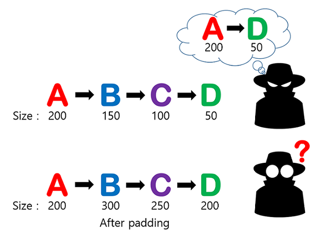
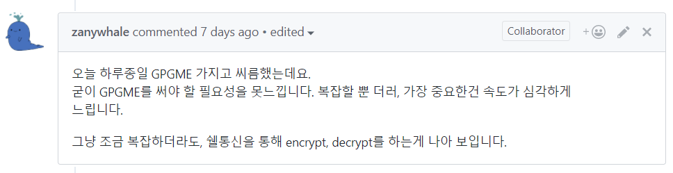
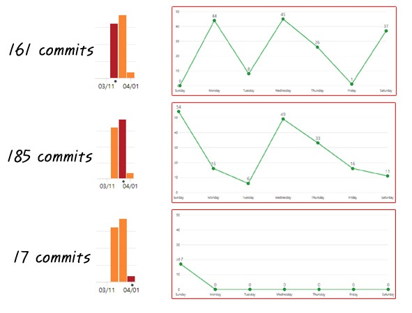

## Activity3 - Onion Messenger
### Team HER

- TA : SeongIl Wi
- DongHyeon Oh(Team Leader)
- SeungYeop Lee
- NakJun Choi
- SeJin Jeong

Note:
Hi everyone, This is TEAM 3, TEAM HER.  
I'm Nakjun Choi.  
We prepared this presentation to sell our messenger program.  
Okay. Let's start our pesentation.

---

### 툥용되는 메신저 과연 안전?

* 상기 이미지는 예시일뿐, 특정 메신저와 관련이  
없습니다.

Note:
First, I would like to ask you. Do you really trust the popular messengers?  
To be honest, I'm not.  
I can not trust these messengers.  
Because of this!

---

Image from : https://www.youtube.com/watch?v=oMXETBknh34

Note:
Sometimes, some attackers want to steal messages from others, and I think that is possible.  
This is a very important issue in security.  
So we need a new messenger to complement this.

---

### Fantastic HER!

Note:
So!!!! We are here. Fantastic HER!!!  
With a messenger to present a new paradigm.

---

### Promotion video

Note:
Before the full introduction, you have to watch this promotion video to create interest.  
We made this very difficult.  
Okay, Let's go.

---

### Her 메신저란?
- PGP를 이용한 암호화된 메시지 송/수신
- OnionRouting으로 중간단계에서 발신자,  
수신자 익명화
- 메신저 송/수신 경로 random 지정
- Docker에 생소한 사용자의 편의성 강화

Note:
Fantastic video.  
I know that you guys are curious about HER Messenger.  
So I'll talk about the basic functions of HER Messenger briefly.  
First, it is possible to encrypt and decrypt the message for communication.  
Second, it used onion routing for anonymity.  
In addition, it specifies the routing path randomly, not in order.  
Finally, we made it easy for people who do not know the docker to use it.  

---

OnionRouting?  

Note:
Then, what is onion routing?  
This is a picture that explains onion routing.  
If user A wants to send a message to user D and the random path is set to ABCD,  
then first, user A encrypts the message with user D's public key.  
After that, user A encrypts this with user C's public key.  
And then, user A encrypts this again with user B's public key and sends it to B.  
The user BCD then decrypt this in order.  

This structure is like an onion. So it was named onion routing.

---

### 프로그램 시연

Note:
There is a Korean proverb said 백문이불여일견.  
So i will show the operation of our program.  
Right now.

---

### 질문있습니다!

Image from : https://www.youtube.com/watch?v=oHzh_R7yjHA

Note:
I think that some people may have some questions like our proffesor.  
In fact, professor has allowed us to use his picture.  
That's why i used this picture.

---

### Question.1

Note:
The first question is "Should we install a lot of things?"  
The answer is "No!!"  

---

1. 도커 설정 : ./AutoDocker.sh
2. 프로그램 실행 : ./startMessenger.sh

Note:
If you already have a docker, you just have to enter "./AutoDocker.sh".  
Then type a "./startMessenger.sh" to start the program.  
After you type your github ID and PW, you can see this first page.  
It's very easy, right?

---

### Question.2

Note:
The second question is "Is this really encryption?"  
The answer is "Yes!!"  
I can show you.

---

A와 B 통신시, 메시지가 암호화되어  
랜덤으로 다른 노드들을 거치는 모습

Note:
As you can see, when users communicate with each other,  
random nodes are sending and receiving encrypted messages in order.  
This is a very beautiful sight, and this can prove our encryption.

---

### Question.3

Note:
The last question is "Then, Is this slow?"  
The answer is "No, not at all"  

---

매우 빠른 전송속도

Note:
Please look at this image.  
You can see that messages are exchanged almost at the same time.  
It is very fast because it uses very little time for sending and receiving.  

In addition, since we do not use the server, there is no time delay caused by the server.

---

### 특장점
1) 새로운 메시지가 왔을 때 메시지 개수 표시 기능

Note:
In addition to the basic functions, we have developed additional functions.  
Our program displays the number of messages when new messages arrive. Time also.  
And compared to KakaoTalk, I think it is more user-friendly UI.

---

### 특장점
2) OnionRouting에서 padding을 통한 익명성 강화

Note:
And our program implements the padding function which increases the anonymity.  
In general, an attacker can know the sender and recipient by using a shorter message length.  
However, we can prevent this attack by attaching random padding.  
So our messenger is very safe.

---

### 특장점
3) 방향키를 이용한 스크롤 기능

Note:
And we implemented the scroll function using the arrow buttons.  
lkie this pitcure, If you press the up arrow button, you can easily check the past messages.  
This is a very convenient function for users.

---

### 지금 바로 전화주세요!

Note:
As i mentioned earlier, our program has so many advantages.  
We have a simple UI, but it is a more user friendly program.  
So I can confidently recommend our program to everyone.  
If you want to know more about our program, please read our README file.  
There is a detailed description of our protocol.

---

Off the record

Note:
Okay. Our selling part is over.  
From now on, I will tell you about our project.

---

### An important design decision

Note:
In fact, we were going to use an open library called GPGME for messege encryption.
But this library was too slow!  
So we changed the way to just create a file via shell communication.  
And we are all satisfied about this.

I think this is an important design decision in our program.
---

### Our passion
Total 399 commits

Note:
From now on, I want to talk about our passion of this project.  
This is our commit graph.  
We have total 399 commits.

---

### Our passion

Note:
And we covered a total of 31 issues, and have posted a lot of comments.  

---

### Our passion

Note:
like this....
---

### Our passion

Note:
And like this, we have been working on projects with very active communication.
---

### DongHyeon's passion
HER messenger 개발 총괄

Note:
In the case of Dong Hyeon, he managed the development of messenger.  
And I think he is a genius engineer.  
Because sometimes he said, 'I wanna fix this.'  
And almost a one minute later he says, "OK, I fixed it."  
It's great.

---

### SeungYeop's passion
HER messenger 개발

Note:
And SeungYeop also developed our HER messenger.  
All of these issues are managed by SeungYeop.  
And it was developed successfully.  
So he is a genius too.

---

### NakJun's passion
GitPitch, 동영상 촬영 및 편집

Note:
And in my case, because of lack of experience, I participated in other parts than coding.  
I made promotion video and gitpitch.  
I worked very hard to help my team members.

---

### SeJin's passion
Sockthread.cpp 함수 개발, README.md 작성

Note:
Sejin is also similar to me.  
So he made all of README files look very nice.  
And he built the basic structure of the socket thread part.  

I think our team was good teamwork with the perfect work distribution.
So i love my team.

---

## Thank you!

