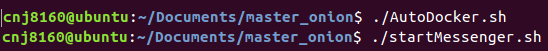
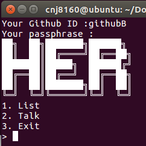
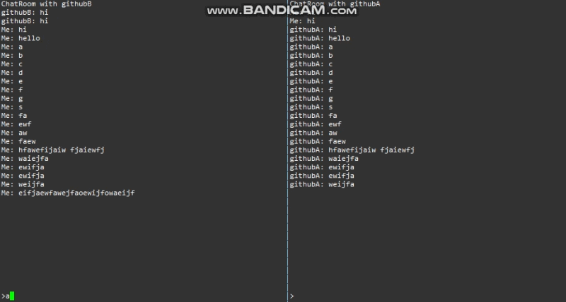
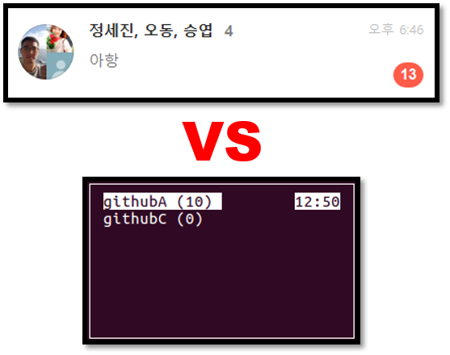
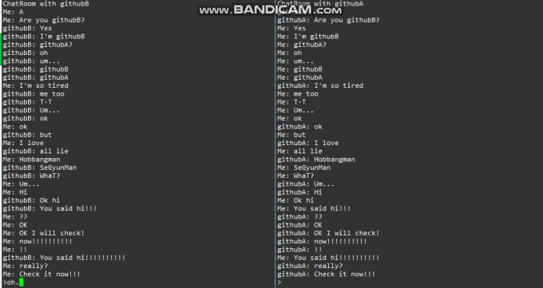
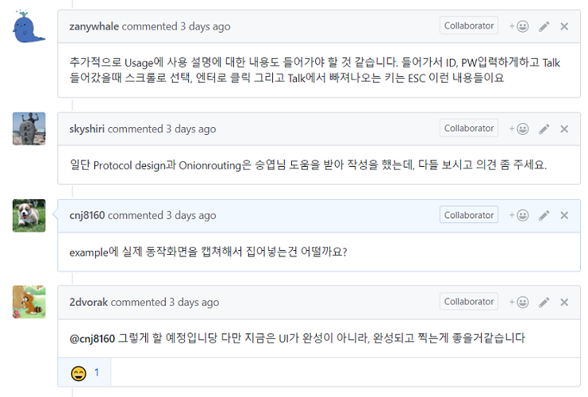
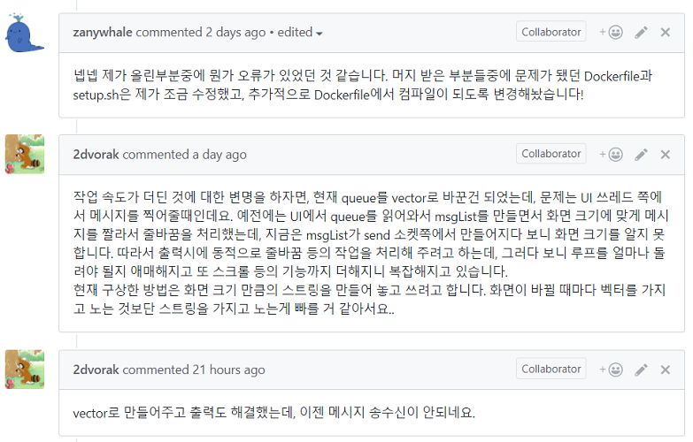

# 제목
### Onion Messenger Activity - Team HER

- TA : SeongIl Wi
- DongHyeon Oh(Team Leader)
- SeungYeop Lee
- NakJun Choi
- SeJin Jeong

---

### 툥용되는 메신저 과연 안전?

* 상기 이미지는 예시일뿐, 특정 메신저와 관련이 없습니다.

---

---

### Fantastic HER!

---

### Promotion video

테스트

---

### Her 메신저란?
- PGP를 이용한 암호화된 메시지 송/수신
- OnionRouting으로 중간단계에서 발신자,  
수신자 익명화
- 메신저 송/수신 경로 random 지정
- Docker에 생소한 사용자의 편의성 강화

---

OnionRouting?  

---

### 프로그램 시연

---

### 질문있습니다!

---

### Question.1

---

1. 도커 설정 : ./AutoDocker.sh
2. 프로그램 실행 : ./startMessenger.sh

---

### Question.2

---

---

### Question.3

---

---

### 특장점
1) 새로운 메시지가 왔을 때 메시지 개수 표시 기능

---

### 특장점
2) OnionRouting에서 padding을 통한 익명성 강화

---

### 특장점
3) 방향키를 이용한 스크롤 기능

---

### 지금 바로 전화주세요!

---

Off the record

---
### An important design decision

---

### Our passion

---

### Our passion

---

### Our passion

---

### DongHyeon's passion
HER messenger 개발 총괄

---

### SeungYeop's passion
HER messenger 개발

---

### NakJun's passion
GitPitch, 동영상 촬영 및 편집

---

### SeJin's passion
Sockthread.cpp 함수 개발, README.md 작성

---

## Thank you!

