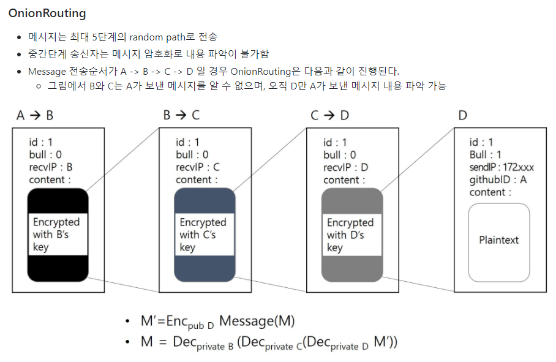
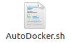
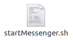
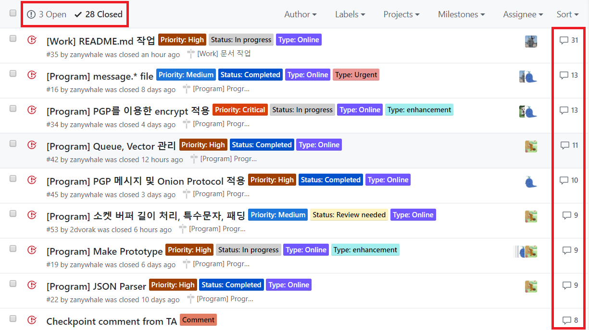
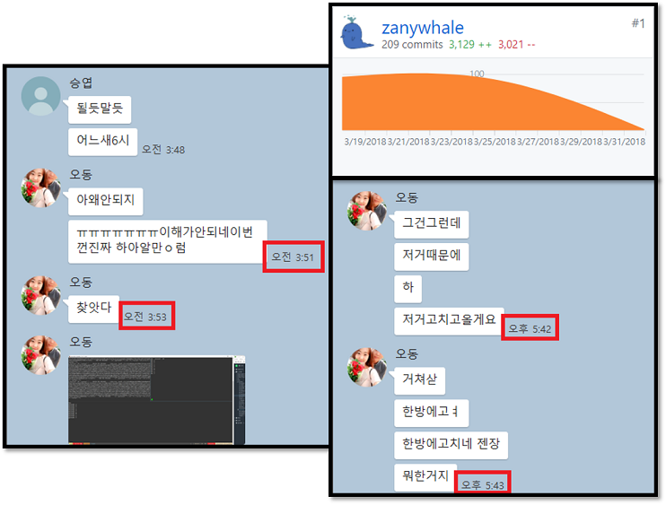
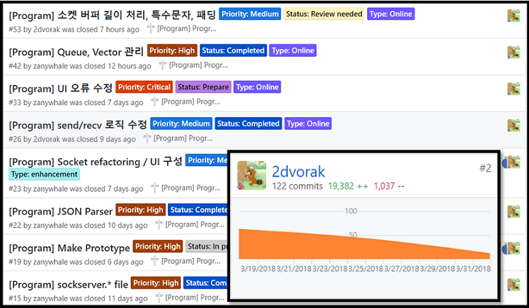
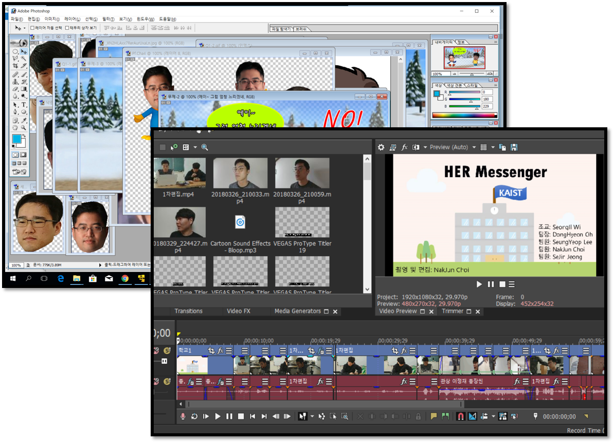
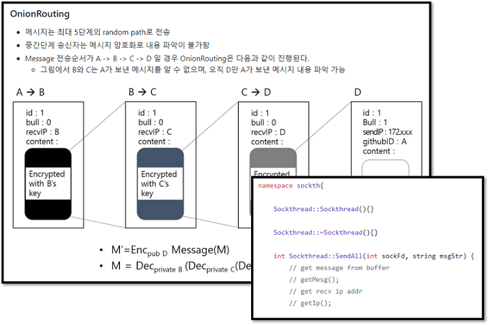
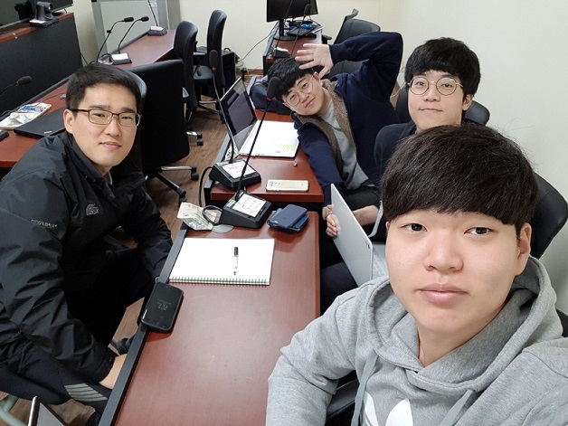

# 제목
### Onion Messenger Activity - Team HER

- TA : SeongIl Wi
- DongHyeon Oh(Team Leader)
- SeungYeop Lee
- NakJun Choi
- SeJin Jeong

---
### Promotion video

테스트
---

### 툥용되는 메신저 과연 안전?

* 상기 이미지는 예시일뿐, 특정 메신저와 관련이 없습니다.

---

---

### 우리가 왔다!

---

### Her 메신저란?
- PGP를 이용한 암호화된 메시지 송/수신
- OnionRouting으로 중간단계에서 발신자, 수신자 익명화
- 메신저 송/수신 경로 random 지정
- Docker에 생소한 사용자의 편의성 강화

---

OnionRouting?  

---

### 프로그램 시연

---

### 질문있습니다!

---

### Question.1

---

1. ./AutoDocker.sh : 도커 설정

2. ./startMessenger.sh : 프로그램 실행

---

### Question.2

---

랜덤경로로 암호화 되는 영상 or gif

---

### Question.3

---

빠른 속도.jpg or gif

---

### 특장점
1. 새로운 메시지가 왔을 때 메시지 개수 표시 기능

UI 관련 장점 어필(스크롤 등)

---

### 특장점
2. OnionRouting에서 padding을 통한 익명성 강화

---

### 특장점
3.

---

### Our passion

---
### DongHyeon's passion

HER messenger 개발 총괄
---

### SeungYeop's passion

HER messenger 개발
---

### NakJun's passion

GitPitch, 동영상 촬영 및 편집
---

### SeJin's passion

Sockthread.cpp 함수 개발, README.md 작성
---

## Thank you!

