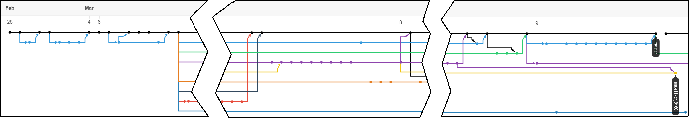

# 2018s-presentation-team3

## Team name

 - HER
 ```
 -  컬링에서 사용하는 용어로, 스위핑을 더 빠르게 하라는 의미 (Hurry의 준말)
 -  얼음을 빨리 닦을수록 더 멀리 나가는 것처럼, 학문을 갈고 닦아 실력을 더욱 증진시키자는 의미
 ```

## Team member

| Team member     | Position | Assignment |
|:-----------------:|:----------:|------------|
|  Seongil Wi     |    TA    |   Advice   |
|  DongHyeon Oh   |   팀장   | css 적용, 발표 포맷 작성, Git merge & resolve conflict, Typo & 문법 확인|
|  SeungYeop Lee  |   팀원   | Conclusion & 발표 포맷 작성, Typo & 문법 확인|
|  NakJun Choi    |   팀원   | README & PITCHUSAGE 작성, Typo & 문법 확인 |
|  SeJin Jeong    |   팀원   | Introduction 작성, Typo & 문법 확인 |

## Directory structure

> [__PITCHME.md__](https://github.com/KAIST-IS521/2018s-presentation-team3/blob/master/PITCHME.md) * *최종 Presentation 파일* *  
> [__PITCHME.yaml__](https://github.com/KAIST-IS521/2018s-presentation-team3/blob/master/PITCHME.yaml) * *템플릿 설정* *  
> [__PITCHUSAGE.md__](https://github.com/KAIST-IS521/2018s-presentation-team3/blob/master/PITCHUSAGE.md) * *GitPitch 작성법 설명* *  
> [__README.md__](https://github.com/KAIST-IS521/2018s-presentation-team3/blob/master/README.md) * *팀 소개 및 기타 내용* *  
> [__assets__](https://github.com/KAIST-IS521/2018s-presentation-team3/tree/master/assets)
>> [__css__](https://github.com/KAIST-IS521/2018s-presentation-team3/tree/master/assets/css) * *템플릿 설정* *  
>> [__image__](https://github.com/KAIST-IS521/2018s-presentation-team3/tree/master/assets/image) * *템플릿 설정을 위한 이미지* *  
>  
> [__images__](https://github.com/KAIST-IS521/2018s-presentation-team3/tree/master/images) * *개인별 발표를 위한 이미지* *  
> [__members__](https://github.com/KAIST-IS521/2018s-presentation-team3/tree/master/members) * *개인별 Presentation 파일* *  
>> [__donghyeon.md__](https://github.com/KAIST-IS521/2018s-presentation-team3/blob/master/members/donghyeon.md)  
>> [__format.md__](https://github.com/KAIST-IS521/2018s-presentation-team3/blob/master/members/format.md) * *발표 양식* *  
>> [__nakjun.md__](https://github.com/KAIST-IS521/2018s-presentation-team3/blob/master/members/nakjun.md)  
>> [__sejin.md__](https://github.com/KAIST-IS521/2018s-presentation-team3/blob/master/members/sejin.md)  
>> [__seungyeop.md__](https://github.com/KAIST-IS521/2018s-presentation-team3/blob/master/members/seungyeop.md)


## Insight

  
3월 10일 기준, insight-network

## Presentation

 - [https://gitpitch.com/KAIST-IS521/2018s-presentation-team3/master](https://gitpitch.com/KAIST-IS521/2018s-presentation-team3/master)
